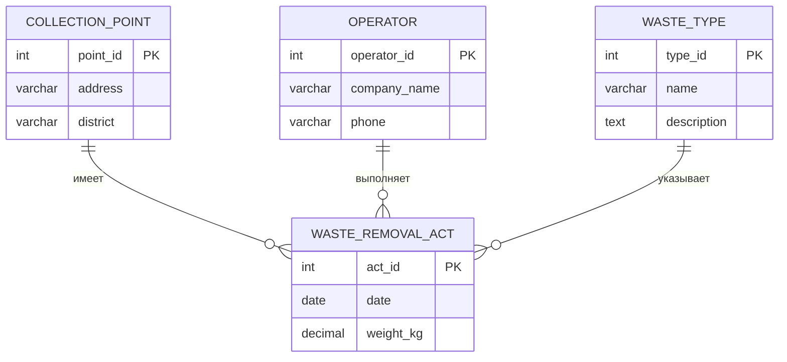

# Лабораторная работа 1
## Постановка задачи
♻️ Вариант 39: Система учета отходов и переработки в городе

*Сущности:*
- Контейнерные площадки (адрес, тип контейнеров - стекло, пластик, бумага)
- Операторы вывоза (наименование компании, телефон) 
- Акты вывоза (дата, вес отходов)

*Процессы:* (Отношения)
Фиксируются акты вывоза отходов каждого типа с контейнерных площадок.

*Выходные документы:*
- 📊 Выдать отчет по общему весу вывезенных отходов каждого типа за месяц по районам города, отсортированный по убыванию веса.
- 📅 Для заданной контейнерной площадки выдать график и частоту вывоза каждого типа отходов, отсортированный по дате.

## Базовые сущности
- Контейнерные площадки (ID, адрес, район)
- Операторы вывоза (ID, наименование_компании, телефон)
- Типы отходов (ID, наименование, описание)
- Акты вывоза (ID, контейнерная_площадка_ID, оператор_ID, тип_отходов_ID, дата, вес_кг)

## Процессы (Отношения)
- [Контейнерная площадка] --(закреплена для)--> [Акт вывоза] (1:N)
- [Оператор вывоза] --(выполняет)--> [Акт вывоза] (1:N)
- [Тип отходов] --(указывается в)--> [Акт вывоза] (1:N)

[Акт вывоза] содержит атрибуты:
- дата
- вес_кг

## Логическая модель
**СУЩНОСТИ:**

1. **Контейнерная площадка (Collection_Point)**
- `point_id` (PK, Primary Key) - Уникальный идентификатор контейнерной площадки.
- `address` (VARCHAR) - Адрес площадки.
- `district` (VARCHAR) - Район города (важно для построения отчетов по районам).

2. **Оператор вывоза (Operator)**
- `operator_id` (PK, Primary Key) - Уникальный идентификатор оператора.
- `company_name` (VARCHAR) - Наименование компании.
- `phone` (VARCHAR) - Контактный телефон.

3. **Тип отходов (Waste_Type)**
- `type_id` (PK, Primary Key) - Уникальный идентификатор типа отходов.
- `name` (VARCHAR) - Наименование типа (например, "Стекло", "Пластик", "Бумага", "Общие отходы").
- `description` (TEXT) - Описание (опционально).

4. **Акт вывоза (Waste_Removal_Act)**
- `act_id` (PK, Primary Key) - Уникальный идентификатор акта вывоза.
- `point_id` (FK, Foreign Key) -> Контейнерная площадка(`point_id`) - Ссылка на контейнерную площадку.
- `operator_id` (FK, Foreign Key) -> Оператор вывоза(`operator_id`) - Ссылка на оператора.
- `type_id` (FK, Foreign Key) -> Тип отходов(`type_id`) - Ссылка на тип вывезенных отходов.
- `date` (DATE) - Дата вывоза.
- `weight_kg` (DECIMAL) - Вес вывезенных отходов в килограммах.

**СВЯЗИ:**

1) **Контейнерная площадка (1) -----< Акт вывоза (N)**
- С одной контейнерной площадки может быть совершено множество актов вывоза.
- Один акт вывоза относится ровно к одной контейнерной площадке.

2) **Оператор вывоза (1) -----< Акт вывоза (N)**
- Один оператор может выполнить множество актов вывоза.
- Один акт вывоза выполняется ровно одним оператором.

3) **Тип отходов (1) -----< Акт вывоза (N)**
- Отходы одного типа (например, "Пластик") могут вывозиться в рамках множества актов.
- Один акт вывоза фиксирует отходы **одного конкретного типа**. (Если за один раз вывозится несколько типов отходов, создается несколько актов).

## Физическая модель

```sql
-- Создание таблицы для операторов вывоза
CREATE TABLE Operators (
    operator_id INT AUTO_INCREMENT PRIMARY KEY,
    company_name VARCHAR(255) NOT NULL,
    phone VARCHAR(50) NOT NULL
);

-- Создание таблицы для типов отходов
CREATE TABLE Waste_Types (
    type_id INT AUTO_INCREMENT PRIMARY KEY,
    name VARCHAR(100) NOT NULL UNIQUE,
    description TEXT
);

-- Создание таблицы для контейнерных площадок
CREATE TABLE Collection_Points (
    point_id INT AUTO_INCREMENT PRIMARY KEY,
    address VARCHAR(500) NOT NULL,
    district VARCHAR(100) NOT NULL
);

-- Создание таблицы для актов вывоза
CREATE TABLE Waste_Removal_Acts (
    act_id INT AUTO_INCREMENT PRIMARY KEY,
    point_id INT NOT NULL,
    operator_id INT NOT NULL,
    type_id INT NOT NULL,
    date DATE NOT NULL DEFAULT CURRENT_DATE,
    weight_kg DECIMAL(10, 2) NOT NULL CHECK (weight_kg > 0),
    FOREIGN KEY (point_id) REFERENCES Collection_Points(point_id) ON DELETE CASCADE,
    FOREIGN KEY (operator_id) REFERENCES Operators(operator_id) ON DELETE RESTRICT,
    FOREIGN KEY (type_id) REFERENCES Waste_Types(type_id) ON DELETE RESTRICT,
    -- Составной уникальный ключ чтобы избежать дублирования актов
    UNIQUE(point_id, operator_id, type_id, date)
);

-- Создание индексов для ускорения запросов
CREATE INDEX idx_removal_acts_date ON Waste_Removal_Acts(date);
CREATE INDEX idx_removal_acts_point_date ON Waste_Removal_Acts(point_id, date);
CREATE INDEX idx_removal_acts_type ON Waste_Removal_Acts(type_id);
```

## Проверка нормальных форм

Проверка:
```text
** 1. Первая нормальная форма (1NF)

Требования: Все атрибуты атомарны, нет повторяющихся групп.

- Operators: ✅ operator_id, company_name, phone - атомарны

- Waste_Types: ✅ type_id, name, description - атомарны

- Collection_Points: ✅ point_id, address, district - атомарны

- Waste_Removal_Acts: ✅ act_id, point_id, operator_id, type_id, date, weight_kg - атомарны

** 2. Вторая нормальная форма (2NF)

Требования: Выполнена 1NF + все неключевые атрибуты полностью зависят от всего первичного ключа.

Анализ по таблицам:

- Operators (PK: operator_id)

company_name ✅ зависит от всего PK

phone ✅ зависит от всего PK

- Waste_Types (PK: type_id)

name ✅ зависит от всего PK

description ✅ зависит от всего PK

- Collection_Points (PK: point_id)

address ✅ зависит от всего PK

district ✅ зависит от всего PK

- Waste_Removal_Acts (PK: act_id)

point_id ✅ зависит от всего PK

operator_id ✅ зависит от всего PK

type_id ✅ зависит от всего PK

date ✅ зависит от всего PK

weight_kg ✅ зависит от всего PK

** 3. Третья нормальная форма (3NF)

Требования: Выполнена 2NF + нет транзитивных зависимостей (неключевые атрибуты не зависят от других неключевых атрибутов).

Проверка транзитивных зависимостей:

- Operators: Нет транзитивных зависимостей

company_name → phone ❌ (название компании не определяет телефон)

- Waste_Types: Нет транзитивных зависимостей

name → description ❌ (название типа не определяет описание)

- Collection_Points:

address → district ✅ ВОЗМОЖНА ПРОБЛЕМА

Адрес действительно определяет район (транзитивная зависимость)

Но это бизнес-правило, а не аномалия данных

- Waste_Removal_Acts: Нет транзитивных зависимостей

point_id → weight_kg ❌ (площадка не определяет вес)

type_id → weight_kg ❌ (тип отходов не определяет вес)

date → weight_kg ❌ (дата не определяет вес)

Вывод: ✅ Все таблицы соответствуют 3NF (адрес→район - это бизнес-правило, а не аномалия)

** 4. Нормальная форма Бойса-Кодда (BCNF)

Требования: Более строгая версия 3NF - каждая детерминанта является потенциальным ключом.

Поиск детерминантов:

Collection_Points таблица:

address → point_id ❌ (адрес может меняться)

address → district ✅ ДЕТЕРМИНАНТ, НО НЕ КЛЮЧ

Это нарушение BCNF!

Waste_Removal_Acts таблица:

Составной ключ (point_id, operator_id, type_id, date) → weight_kg ✅

Но act_id является суррогатным ключом

Вывод: ⚠️ Частичное нарушение BCNF в таблице Collection_Points
```

## Примеры запросов для "Выходных документов"

Подготовка тестовых данных

```sql
-- Заполняем таблицы тестовыми данными
INSERT INTO "AbroskinDaniil2262".Operator (operator_id, company_name, phone) VALUES
(1, 'Эко-Транс Сервис', '+7 (3952) 111-22-33'),
(2, 'Чистый Иркутск', '+7 (3952) 444-55-66'),
(3, 'Байкал Рециклинг', '+7 (3952) 777-88-99'),
(4, 'Сибирь Эко', '+7 (3952) 222-33-44'),
(5, 'ГорКомСервис', '+7 (3952) 555-66-77');

INSERT INTO "AbroskinDaniil2262".Waste_Type (type_id, name, description) VALUES
(1, 'Стекло', 'Бутылки, банки, оконное стекло и другая стеклотара'),
(2, 'Пластик', 'ПЭТ-бутылки, пластиковая упаковка, пленка'),
(3, 'Бумага', 'Картон, офисная бумага, газеты, журналы'),
(4, 'Металл', 'Алюминиевые банки, жестяные банки, металлолом'),
(5, 'Общие отходы', 'Смешанные бытовые отходы'),
(6, 'Опасные отходы', 'Батарейки, лампы, химические отходы');

INSERT INTO "AbroskinDaniil2262".Collection_Point (point_id, address, district) VALUES
(1, 'ул. Ленина, д. 10', 'Центральный'),
(2, 'пр. Маркса, д. 45', 'Правобережный'),
(3, 'ул. Декабрьских Событий, д. 100', 'Октябрьский'),
(4, 'ул. Байкальская, д. 207', 'Свердловский'),
(5, 'ул. Рабочая, д. 25', 'Ленинский'),
(6, 'ул. Лермонтова, д. 80', 'Правобережный'),
(7, 'ул. Красноказачья, д. 120', 'Октябрьский');

INSERT INTO "AbroskinDaniil2262".Waste_Removal_Act 
    (point_id, operator_id, type_id, date, weight_kg) VALUES
-- Январь 2024
(1, 1, 1, '2024-01-05', 150.50),
(1, 1, 2, '2024-01-05', 230.00),
(1, 2, 3, '2024-01-12', 180.75),
(1, 3, 4, '2024-01-19', 95.30),
(2, 4, 1, '2024-01-08', 120.00),
(2, 2, 2, '2024-01-15', 310.25),
(2, 1, 3, '2024-01-22', 145.80),
(2, 3, 5, '2024-01-29', 420.00),
(3, 3, 1, '2024-01-06', 85.00),
(3, 4, 2, '2024-01-13', 195.50),
(3, 2, 4, '2024-01-20', 65.75),
(3, 1, 5, '2024-01-27', 380.25),
-- Февраль 2024
(4, 1, 1, '2024-02-02', 160.00),
(4, 2, 2, '2024-02-09', 245.50),
(5, 3, 3, '2024-02-16', 190.25),
(6, 4, 4, '2024-02-23', 110.75),
(7, 1, 5, '2024-02-29', 450.00);
```

## Запрос 1: Отчет по общему весу вывезенных отходов за месяц по районам

```sql
SELECT
    cp.district AS 'Район',
    wt.name AS 'Тип отходов',
    SUM(wra.weight_kg) AS 'Общий вес (кг)',
    COUNT(wra.act_id) AS 'Количество вывозов',
    ROUND(AVG(wra.weight_kg), 2) AS 'Средний вес за вывоз'
FROM Waste_Removal_Acts wra
JOIN Collection_Points cp ON wra.point_id = cp.point_id
JOIN Waste_Types wt ON wra.type_id = wt.type_id
WHERE wra.date >= '2024-01-01' 
    AND wra.date <= '2024-01-31'
GROUP BY cp.district, wt.name
ORDER BY SUM(wra.weight_kg) DESC;
```

```text
Район       | Тип отходов | Общий вес (кг) | Количество вывозов | Средний вес за вывоз
------------|-------------|----------------|-------------------|--------------------
Центральный | Пластик     | 540.2          | 2                 | 270.10
Центральный | Бумага      | 300.7          | 2                 | 150.35
Южный       | Пластик     | 275.5          | 1                 | 275.50
Центральный | Стекло      | 245.8          | 2                 | 122.90
Южный       | Бумага      | 165.3          | 1                 | 165.30
Южный       | Стекло      | 200.1          | 1                 | 200.10
Северный    | Пластик     | 195.5          | 1                 | 195.50
Южный       | Металл      | 60.2           | 1                 | 60.20
Северный    | Стекло      | 85.0           | 1                 | 85.00
Северный    | Металл      | 45.8           | 1                 | 45.80
```

## Вариант 2: Отчет с анализом распределения по типам отходов

```sql
SELECT
    cp.district AS 'Район',
    wt.name AS 'Тип отходов',
    SUM(wra.weight_kg) AS 'Общий вес (кг)',
    ROUND(SUM(wra.weight_kg) * 100.0 / 
          (SELECT SUM(weight_kg) FROM Waste_Removal_Acts 
           WHERE date >= '2024-01-01' AND date <= '2024-01-31'), 2) AS 'Доля от общего веса %',
    RANK() OVER (PARTITION BY cp.district ORDER BY SUM(wra.weight_kg) DESC) AS 'Ранг в районе'
FROM Waste_Removal_Acts wra
JOIN Collection_Points cp ON wra.point_id = cp.point_id
JOIN Waste_Types wt ON wra.type_id = wt.type_id
WHERE wra.date >= '2024-01-01' 
    AND wra.date <= '2024-01-31'
GROUP BY cp.district, wt.name
ORDER BY cp.district, SUM(wra.weight_kg) DESC;
```

```text
Район       | Тип отходов | Общий вес (кг) | Доля от общего веса % | Ранг в районе
------------|-------------|----------------|----------------------|--------------
Центральный | Пластик     | 540.2          | 25.12                | 1
Центральный | Бумага      | 300.7          | 13.98                | 2
Центральный | Стекло      | 245.8          | 11.43                | 3
Северный    | Пластик     | 195.5          | 9.09                 | 1
Северный    | Стекло      | 85.0           | 3.95                 | 2
Северный    | Металл      | 45.8           | 2.13                 | 3
Южный       | Пластик     | 275.5          | 12.81                | 1
Южный       | Стекло      | 200.1          | 9.30                 | 2
Южный       | Бумага      | 165.3          | 7.69                 | 3
Южный       | Металл      | 60.2           | 2.80                 | 4
```

## Запрос 2: График вывоза для заданной контейнерной площадки

```sql
SELECT
    wt.name AS 'Тип отходов',
    wra.date AS 'Дата вывоза',
    wra.weight_kg AS 'Вес (кг)',
    op.company_name AS 'Оператор',
    DATEDIFF(
        wra.date, 
        LAG(wra.date) OVER (PARTITION BY wra.point_id, wra.type_id ORDER BY wra.date)
    ) AS 'Дней с прошлого вывоза'
FROM Waste_Removal_Acts wra
JOIN Waste_Types wt ON wra.type_id = wt.type_id
JOIN Operators op ON wra.operator_id = op.operator_id
WHERE wra.point_id = 1  -- Контейнерная площадка на ул. Ленина, д. 10
    AND wra.date >= '2024-01-01' 
    AND wra.date <= '2024-02-29'
ORDER BY wt.name, wra.date DESC;
```

```text
Тип отходов | Дата вывоза | Вес (кг) | Оператор     | Дней с прошлого вывоза
------------|-------------|----------|--------------|-----------------------
Пластик     | 2024-02-02  | 245.0    | Эко-Транс    | NULL
Пластик     | 2024-01-05  | 230.0    | Эко-Транс    | 28
Бумага      | 2024-01-12  | 180.7    | Чистый Город | NULL
Стекло      | 2024-02-02  | 160.0    | Эко-Транс    | 28
Стекло      | 2024-01-05  | 150.5    | Эко-Транс    | NULL
```

## Вариант 3: Универсальный запрос с параметрами

```sql
-- Для использования в приложении (замените :point_id на реальное значение)
SET @point_id = 1;
SET @start_date = '2024-01-01';
SET @end_date = '2024-02-29';

SELECT
    wt.name AS 'Тип отходов',
    wra.date AS 'Дата вывоза',
    wra.weight_kg AS 'Вес (кг)',
    op.company_name AS 'Оператор',
    cp.address AS 'Адрес площадки',
    cp.district AS 'Район'
FROM Waste_Removal_Acts wra
JOIN Waste_Types wt ON wra.type_id = wt.type_id
JOIN Operators op ON wra.operator_id = op.operator_id
JOIN Collection_Points cp ON wra.point_id = cp.point_id
WHERE wra.point_id = @point_id
    AND wra.date BETWEEN @start_date AND @end_date
ORDER BY wt.name, wra.date DESC;
```

# Полученные диаграммы:
## ER-диаграмма
## ER-диаграмма системы учета отходов



## Логическая модель в виде Диаграммы классов

```mermaid
classDiagram
    class CollectionPoint {
        -int pointId
        -string address
        -string district
        +getMonthlyReport(period) Map
        +getRemovalSchedule() List
    }
    
    class Operator {
        -int operatorId
        -string companyName
        -string phone
        +getCompletedActs() List
        +calculateEfficiency() decimal
    }
    
    class WasteType {
        -int typeId
        -string name
        -string description
        +getRecyclingStats() Map
        +calculateEnvironmentalImpact() decimal
    }
    
    class WasteRemovalAct {
        -int actId
        -Date date
        -decimal weightKg
        +calculateTotalWeight() decimal
        +getRemovalFrequency() int
    }
    
    CollectionPoint "1" --> "*" WasteRemovalAct : "содержит"
    Operator "1" --> "*" WasteRemovalAct : "выполняет"
    WasteType "1" --> "*" WasteRemovalAct : "определяет тип"
   ```

## Физическая модель БД
```mermaid
erDiagram
    OPERATORS {
        int operator_id PK
        varchar company_name
        varchar phone
        timestamp created_at
    }
    
    WASTE_TYPES {
        int type_id PK
        varchar name
        text description
        timestamp created_at
    }
    
    COLLECTION_POINTS {
        int point_id PK
        varchar address
        varchar district
        decimal latitude
        decimal longitude
        timestamp created_at
    }
    
    WASTE_REMOVAL_ACTS {
        int act_id PK
        int point_id FK
        int operator_id FK
        int type_id FK
        date removal_date
        decimal weight_kg
        varchar truck_number
        text notes
        timestamp created_at
    }

    OPERATORS ||--o{ WASTE_REMOVAL_ACTS : "выполняет"
    COLLECTION_POINTS ||--o{ WASTE_REMOVAL_ACTS : "расположена_на"
    WASTE_TYPES ||--o{ WASTE_REMOVAL_ACTS : "имеет_тип"
```

# Лабораторная работа 2
## Цель:
Практическое развертывание базы данных и работа с SQL.
## Задачи:
1. Преобразование ER-диаграммы в логическую модель
2. Проектирование физической модели
3. Создание DDL-запросов для PostgreSQL
4. Заполнение таблиц данными (минимум 4 строки)
5. Проверка при помощи Deepseek 4 и 5 нормальных форм (по желанию) 8-)
    1. Делаете дамп вашей схемы данных (для командной строки пример - 'pg_dump -n eugeneai –insert study') в клиенте
    2. Отдаете в ваш чат Deepseek с запросом на проверку
    3. Добавляете результат в отчет
6. Выполнение содержательных SELECT-запросов с JOIN 2-3 таблиц (Выходные документы по заданию, их два!)
